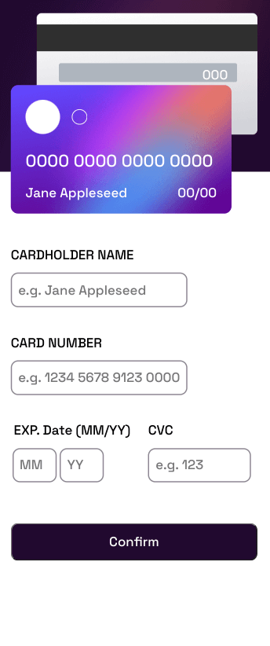
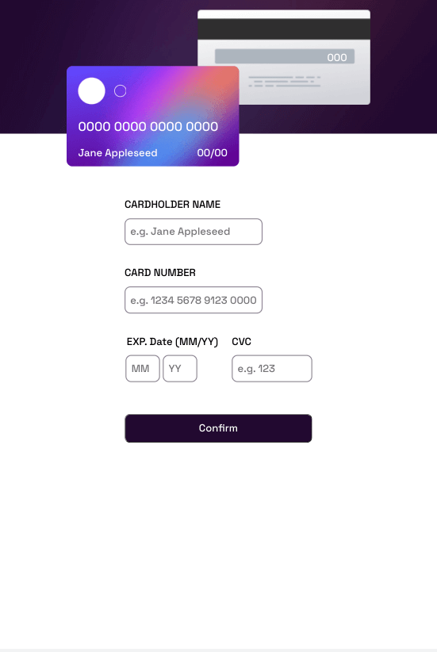
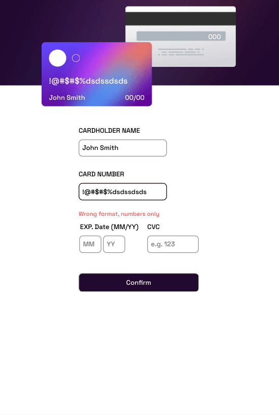
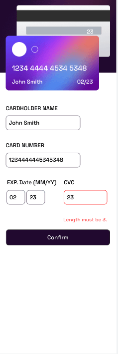

# Frontend Mentor - Interactive card details form solution

This is a solution to the [Interactive card details form challenge on Frontend Mentor](https://www.frontendmentor.io/challenges/interactive-card-details-form-XpS8cKZDWw). Frontend Mentor challenges help you improve your coding skills by building realistic projects. 

## Table of contents

- [Overview](#overview)
  - [The challenge](#the-challenge)
  - [Screenshot](#screenshot)
  - [Links](#links)
- [My process](#my-process)
  - [Built with](#built-with)
  - [What I learned](#what-i-learned)
  - [Continued development](#continued-development)
  - [Useful resources](#useful-resources)

## Overview

### The challenge

Users should be able to:

- Fill in the form and see the card details update in real-time
- Receive error messages when the form is submitted if:
  - Any input field is empty
  - The card number, expiry date, or CVC fields are in the wrong format
- View the optimal layout depending on their device's screen size
- See hover, active, and focus states for interactive elements on the page

### Screenshot

### Links

- Live Site URL: [Github Pages](https://jdegand.github.io/interactive-card-details-form)

## My process

### Built with

- Semantic HTML5 markup
- CSS custom properties
- Flexbox
- CSS Grid
- Mobile-first workflow

### What I learned

- This probably is easier to do in react vs vanilla javascript.

### Continued development

- Accessibility
- Semantic HTML Improvement
- Validation Improvements

### Useful resources

- [Stack Overflow](https://stackoverflow.com/questions/59796291/split-input-into-separate-boxes) - split input into separate boxes
- [Codepen](https://codepen.io/kostasx/pen/GRgYMrb?editors=1111) - multiple number inputs
- [Stack Overflow](https://stackoverflow.com/questions/9004307/two-input-fields-inside-one-label) - two input fields and one label?
- [Stack Overflow](https://stackoverflow.com/questions/10270452/jquery-change-not-firing-until-blur) - change event not firing until blur
- [Stack Overflow](https://stackoverflow.com/questions/9555143/html-maxlength-attribute-not-working-on-chrome-and-safari) - maxlength and number inputs
- [Stack Overflow](https://stackoverflow.com/questions/53427046/how-to-add-space-between-every-4-characters-in-javascript) - add space between every 4 characters in javascript
- [Stack Overflow](https://stackoverflow.com/questions/32936352/html-number-input-min-and-max-not-working-properly) - min and max not working properly
- [W3 Resource](https://www.w3resource.com/javascript/form/credit-card-validation.php) - credit card validation
- [Javascript Tutorial](https://www.javascripttutorial.net/dom/manipulating/remove-all-child-nodes/) - remove all child nodes
- [W3 Schools](https://www.w3schools.com/howto/howto_css_hide_arrow_number.asp) - hide arrow number
- [Coywolf](https://www.coywolf.news/webmaster/accessible-number-input/) - accessible number input
- [Stack Overflow](https://stackoverflow.com/questions/3617797/regex-to-match-only-letters) - regex to match only letters
- [Stack Overflow](https://stackoverflow.com/questions/14745961/regular-expression-to-restrict-special-characters) - regex to restrict special characters
